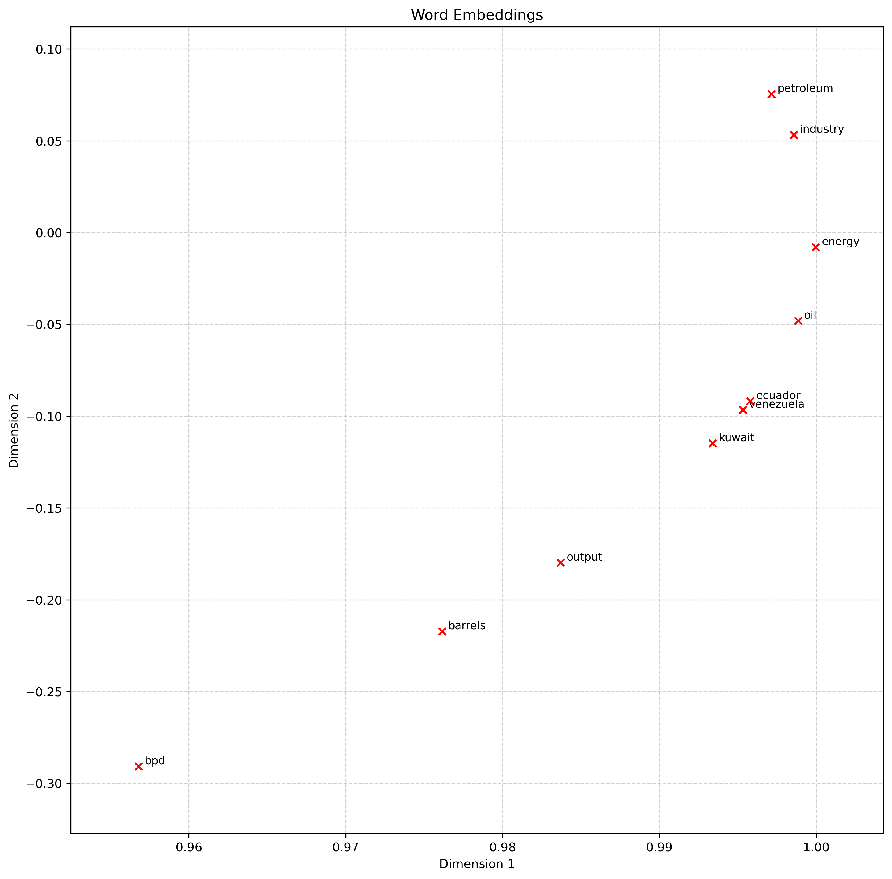

# Word Embedding Co-Occurrence with SVD (wesvd)

`wesvd` is a Python package designed to generate **word embeddings** from a given text corpus using **co-occurrence matrices** and dimensionality reduction via **Truncated SVD (Singular Value Decomposition)**. This package offers an efficient and flexible way to analyze relationships between words in a corpus based on their contextual usage, enabling downstream tasks such as semantic analysis, clustering, or visualization.

<p align="center">
  
</p>

The image shows a 2D plot of word embeddings generated by `wesvd`. Each red `x` represents a word, with positions reflecting semantic relationships from the corpus. For example, related words like `ecuador`, `venezuela`, and `kuwait` are clustered together, highlighting their contextual similarity.

## Why Use `wesvd`?

In natural language processing (NLP), **word embeddings** are essential for capturing semantic and syntactic relationships between words. While popular pre-trained embeddings like Word2Vec or GloVe are available, custom embeddings based on co-occurrence matrices provide:

- **Corpus-Specific Embeddings**: Tailored to the vocabulary and context of your own text data.
- **Explainability**: The co-occurrence matrix explicitly shows how often words co-occur in a defined window size.
- **Flexibility**: Allows you to control parameters like window size and dimensionality to suit your use case.

---

## What Does This Package Do?

1. **Build Co-Occurrence Matrices**:
   - Constructs a matrix where each entry represents the frequency of word co-occurrence within a given window size.

2. **Dimensionality Reduction**:
   - Uses Truncated SVD to reduce the matrix into a lower-dimensional space, generating dense word embeddings.

3. **Word Embedding Normalization**:
   - Normalizes embeddings to unit length for better compatibility with similarity metrics.

4. **2D Visualization**:
   - Plots word embeddings in a 2D space, enabling intuitive exploration of relationships between words.

---

## Installation

### **Using Conda**
This package is distributed as a Conda environment. To install:

```bash
conda env create -f environment.yml
conda activate wesvd
```

### **Editable Installation**

Important, install this package as editable:

```bash
pip install -e .
```

This enables you to modify the source code and immediately use the changes without reinstallation.

## Usage

1. Using wesvd as a Command-Line Script

    Run the main script to generate embeddings and visualizations:

    ```bash
    cd src
    python main.py [OPTIONS]
    ```
    | Argument               | Description                                                                 | Default Value        |
    |------------------------|-----------------------------------------------------------------------------|----------------------|
    | `--corpus_file`         | Path to the corpus file (one tokenized document per line).                  | Default corpus       |
    | `--window_size`         | Size of the context window for co-occurrence calculation.                  | `4`                  |
    | `--k_dim`               | Number of dimensions for reduced embeddings.                               | `2`                  |
    | `--output_embeddings`   | File name to save the reduced embeddings (in `.npy` format).               | `embeddings.npy`     |
    | `--output_plot`         | File name to save the embeddings plot (in `.png` format).                  | `embeddings.png`     |
    | `--words_to_visualize`  | List of words to visualize in the embedding space.                         | None                 |

    #### **Example**
    ```bash
    python main.py --corpus_file data/corpus.txt --window_size 5 --k_dim 50 --output_embeddings my_embeddings.npy --output_plot my_plot.png --words_to_visualize oil energy industry petroleum
    ```

    - Computes embeddings for the corpus in data/corpus.txt.
	- Uses a context window size of 5.
	- Saves the reduced embeddings to my_embeddings.npy.
	- Generates a 2D plot for the specified words and saves it as my_plot.png.

Additionally, the logic can be easily tested and explored interactively in the notebook located at `tests/01_test_package.ipynb`.

2. Using wesvd as a Python Library

    You can import and use wesvd functions directly in your Python scripts or notebooks:

    #### **Example**
     ```python
    from src.utils import read_corpus
    from src.main import compute_co_occurrence_matrix, reduce_to_k_dim, normalize_embeddings, plot_embeddings

    # Read corpus
    corpus = read_corpus("data/corpus.txt")

    # Compute co-occurrence matrix
    window_size = 4
    co_occurrence_matrix, word2ind = compute_co_occurrence_matrix(corpus, window_size)

    # Reduce dimensions
    k = 2
    reduced_embeddings = reduce_to_k_dim(co_occurrence_matrix, k)

    # Normalize embeddings
    normalized_embeddings = normalize_embeddings(reduced_embeddings)

    # Plot embeddings for specific words
    words_to_visualize = ['oil', 'energy', 'industry', 'petroleum']
    plot_embeddings(normalized_embeddings, word2ind, words_to_visualize, "word_embeddings.png")
    ```

## Outputs

1. Embeddings File

    The embeddings are saved as a NumPy array in the specified file (default: output/embeddings/embeddings.npy). These embeddings can be loaded for further processing:

    ```python
    import numpy as np

    embeddings = np.load("output/embeddings/embeddings.npy")
    print(embeddings.shape)  # Shape: (num_words, k_dim)
    ```
2. Plot File

    The plot file (default: output/plots/embeddings.png) shows the 2D projection of the specified words:

## Customizing

### **Corpus Format**

The input corpus should be a plain text file where each line is a tokenized document. Example:


```bash
START The quick brown fox jumps over the lazy dog END
START Machine learning models are trained on data END
START Word embeddings capture semantic relationships END
```

## Modifying Parameters

You can modify the context window size, number of dimensions, and other parameters either by command-line arguments or directly in the function calls.

## Testing the Package

Run the unit tests to ensure everything works as expected:

```bash
pytest tests/
```

## License

This project is licensed under the MIT License. See the LICENSE file for details.

## Acknowledgments

This project was inspired by Natural Language Processing with Deep Learning course provided by Stanford University TODO:INSERT LINK and aims to provide an easy-to-use framework for creating and visualizing custom word embeddings.
